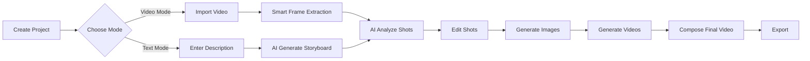

<h1 align="center">🎬 Storyboard Studio</h1>

<p align="center">
  <b>AI-Powered Professional Storyboarding Workbench · Simplify Video Creation</b><br>
  <sub>Video Import → Smart Frame Extraction → AI Analysis → Image/Video Generation → Batch Tasks → Final Composition</sub>
</p>

<p align="center">
  <a href="README.md">中文</a> | <a href="README.en.md">English</a>
</p>

<p align="center">
  
  
  
  
  
  
  
</p>

<p align="center">
  <a href="#-quick-start">Quick Start</a> •
  <a href="#-key-features">Features</a> •
  <a href="#-ui-preview">Screenshots</a> •
  <a href="#-tech-stack">Tech Stack</a> •
  <a href="https://gitee.com/nan1314/Storyboard/releases">Download</a>
</p>

---

## 💡 Why Storyboard Studio?

<table>
<tr>
<td width="50%">

### 🎯 Professional-Grade Tool
- ✨ **Cinema-Level Parameters**: Shot types, composition, lighting, color tone, and more
- 🎨 **Creative Intent Fusion**: Integrate creative goals, audience, and tone into AI generation
- 📊 **Complete Workflow**: One-stop solution from concept to final video

</td>
<td width="50%">

### 🚀 AI-Powered
- 🤖 **Multi-Modal AI**: Text understanding, image generation, video generation
- 🔄 **Smart Storyboarding**: Video auto-storyboarding + text-to-storyboard dual modes
- ⚡ **Batch Processing**: Concurrent task queue execution for maximum efficiency

</td>
</tr>
<tr>
<td width="50%">

### 🔒 Local-First
- 💾 **Local Data**: SQLite local storage, complete data control
- 🛠️ **Bundled Tools**: FFmpeg included, no external dependencies
- 🌐 **Cross-Platform**: Windows / Linux / macOS support

</td>
<td width="50%">

### 🎁 Ready to Use
- 📦 **One-Click Install**: Auto-update, zero configuration
- 🎨 **Modern UI**: Avalonia cross-platform interface, smooth experience
- 🔌 **Flexible Extension**: Multiple AI providers, easy switching

</td>
</tr>
</table>

---

## 🎥 Demo

> 📺 **Online Demo**: [http://47.100.163.84/](http://47.100.163.84/) (UI only, no backend)

<!-- If you have a demo video, add it here:
[](https://www.youtube.com/watch?v=YOUR_VIDEO_ID)
-->

---

## 🌟 Core Features

### 🎬 Dual Creation Modes

<table>
<tr>
<td width="50%" valign="top">

#### 📹 Video Import Mode
Generate storyboard scripts from existing videos

- **Smart Frame Extraction**: 4 extraction modes (fixed count/dynamic/equal time/keyframe)
- **AI Analysis**: Automatically analyze shot characteristics, generate structured descriptions
- **Metadata Extraction**: Auto-extract duration, resolution, frame rate
- **Scene Recognition**: Intelligently identify scene changes and shot transitions

</td>
<td width="50%" valign="top">

#### ✍️ Text Generation Mode
AI generates storyboards from natural language descriptions

- **Smart Splitting**: Automatically split descriptions into multiple shots
- **Scene Understanding**: Recognize scene transitions and shot relationships
- **Intent Fusion**: Combine creative goals, audience, and tone
- **Professional Parameters**: Auto-generate shot types, composition, lighting, etc.

</td>
</tr>
</table>

### 🎨 AI Asset Generation

| Feature | Description | Supported Platforms |
|---------|-------------|---------------------|
| **🖼️ Image Generation** | Generate first/last frames independently with professional parameter control | Qwen, Volcengine Seedream |
| **🎞️ Video Generation** | Generate video clips based on descriptions with camera movement support | Volcengine Seedance |
| **📝 Text Understanding** | Intelligent analysis and storyboard description generation | Qwen, Volcengine, OpenAI |

### ⚙️ Professional Parameter Control

Cinema-grade professional parameters for precise AI generation:

```
📷 Shot Types: Close-up, Medium, Full, Long, Extreme Long
📐 Composition: Rule of Thirds, Symmetry, Golden Ratio, Center
💡 Lighting: Natural, Soft, Backlight, Side Light, Top Light
🎨 Color Tone: Warm, Cool, High Contrast, Desaturated
🎥 Camera Movement: Push/Pull, Pan/Tilt, Tracking, Orbit
```

### 🚀 Batch Task Processing

- ⚡ **Concurrent Execution**: Default 2 concurrent tasks, configurable
- 🔄 **Task Queue**: Support cancel, retry, delete operations
- 📊 **Progress Monitoring**: Real-time task status and progress
- 📜 **History Records**: Complete task execution history

---

## ✨ Key Features

<details open>
<summary><b>📁 Project Management</b></summary>

- ✅ Create/open/switch projects with SQLite local persistence
- ✅ Recent project history for quick access
- ✅ Project-level metadata management (creative intent, video info)
- ✅ Complete project lifecycle management

</details>

<details open>
<summary><b>🎥 Video Import & Analysis</b></summary>

- ✅ Support mainstream video formats (MP4, AVI, MOV, MKV, etc.)
- ✅ Automatic video metadata extraction (duration/resolution/frame rate)
- ✅ FFprobe intelligent video analysis
- ✅ Video preview and timeline display

</details>

<details open>
<summary><b>🖼️ Intelligent Frame Extraction (4 Modes)</b></summary>

| Mode | Description | Use Case |
|------|-------------|----------|
| **Fixed Count** | Extract specified number of keyframes | Quick preview, fixed shot count |
| **Dynamic Interval** | Adjust intervals based on scene changes | Complex scenes, adaptive extraction |
| **Equal Time** | Extract at fixed time intervals | Even distribution, timeline alignment |
| **Keyframe Detection** | Intelligently identify based on scene changes | Precise scene transition capture |

</details>

<details open>
<summary><b>✏️ Storyboard Editing</b></summary>

- ✅ **Full Field Editing**: Shot type, core content, action commands, scene settings
- ✅ **Drag-to-Reorder**: Flexible shot arrangement with real-time preview
- ✅ **Timeline Visualization**: Intuitive display of shot temporal relationships
- ✅ **Multiple View Modes**: Grid view, list view, timeline view
- ✅ **Batch Operations**: Batch edit, delete, copy shots

</details>

<details open>
<summary><b>🤖 AI Intelligence</b></summary>

#### AI Shot Analysis
- ✅ Analyze first/last frame features, generate structured shot descriptions
- ✅ Three processing strategies: Overwrite existing/Append content/Skip existing
- ✅ Integrate creative intent (creative goals, target audience, video tone, key messages)
- ✅ Support batch analysis with queue management

#### Text-to-Storyboard
- ✅ Automatically split natural language descriptions into multiple shots
- ✅ Intelligently identify scene transitions and shot changes
- ✅ Support creative intent-guided generation
- ✅ Auto-generate professional parameters (composition, lighting, color tone, etc.)

</details>

<details open>
<summary><b>🎨 Asset Generation</b></summary>

#### Image Generation
- ✅ First/last frame independent generation with precise control
- ✅ Professional parameter support: composition, lighting, color tone, lens type
- ✅ Multiple generation history retention, user explicit binding of best results
- ✅ Support Qwen Wanx, Volcengine Seedream

#### Video Generation
- ✅ Generate video clips based on shot descriptions
- ✅ Support scene description, action description, style description
- ✅ Camera movement and effects parameter configuration
- ✅ Support Volcengine Seedance

</details>

<details open>
<summary><b>⚙️ Configuration Management</b></summary>

- ✅ **Multi-Provider Support**: Qwen, Volcengine, OpenAI, Azure OpenAI
- ✅ **Multi-Model Configuration**: Text/image/video independently configured
- ✅ **Visual Configuration Interface**: Configure directly in-app, no file editing needed
- ✅ **Flexible Switching**: Select different models and providers per task
- ✅ **Local & Cloud Coexistence**: Local rendering and cloud models can be configured in parallel

</details>

<details open>
<summary><b>📊 Batch Tasks & Task Management</b></summary>

- ✅ Batch analysis, generation, and composition tasks
- ✅ Task queue management with cancel/retry/delete support
- ✅ Concurrent execution (default 2 concurrent, configurable)
- ✅ Task history records with complete audit logs
- ✅ Independent task execution without interference

</details>

<details open>
<summary><b>📤 Export & Output</b></summary>

- ✅ **Storyboard Export**: Export as JSON format, supports CapCut draft import
- ✅ **Video Composition**: FFmpeg composition of final video, multiple resolution support
- ✅ **Output Management**: Project-level output directories, automatic file organization
- ✅ **Format Support**: MP4, AVI, MOV, and other mainstream formats

</details>

---

## 🌐 Online Demo

> 🎮 **Demo URL**: [http://47.100.163.84/](http://47.100.163.84/)
> 💡 **Note**: UI interface only, no backend functionality

---

## 🖼️ UI Preview

<table>
<tr>
<td width="50%">
<h3>🏠 Home - Project Management</h3>

<p>Create new projects, manage recent projects, quick start creation</p>
</td>
<td width="50%">
<h3>🎬 Main Interface - Workspace</h3>

<p>Complete storyboarding workbench, video import, frame extraction, editing all-in-one</p>
</td>
</tr>
<tr>
<td width="50%">
<h3>✏️ Storyboard Editing - Shot Management</h3>

<p>Drag-to-reorder, full field editing, multiple view switching</p>
</td>
<td width="50%">
<h3>🚀 Batch Generation - Task Processing</h3>

<p>Batch generate images and videos, queue management, concurrent execution</p>
</td>
</tr>
<tr>
<td width="50%">
<h3>📊 Task Management - Queue Monitoring</h3>

<p>Real-time task status monitoring, support cancel, retry, delete</p>
</td>
<td width="50%">
<h3>📤 Export - Video Composition</h3>

<p>FFmpeg composition of final video, multiple resolution and format support</p>
</td>
</tr>
</table>

<details>
<summary><b>View More Screenshots</b></summary>

### ⚙️ AI Configuration - Model Settings

*Multi-provider configuration, flexible switching between different AI models*

</details>

---

## 🧭 Complete Workflow



### 📋 Detailed Process

<table>
<tr>
<th width="5%">Step</th>
<th width="20%">Operation</th>
<th width="35%">Description</th>
<th width="40%">Technical Implementation</th>
</tr>
<tr>
<td align="center">1️⃣</td>
<td><b>Create Project</b></td>
<td>Set project name, creative intent</td>
<td>SQLite database creates project record</td>
</tr>
<tr>
<td align="center">2️⃣</td>
<td><b>Import Video</b></td>
<td>Select video file, automatic analysis</td>
<td>FFprobe extracts metadata (duration, resolution, frame rate)</td>
</tr>
<tr>
<td align="center">3️⃣</td>
<td><b>Smart Frame Extraction</b></td>
<td>Select extraction mode, extract keyframes</td>
<td>FFmpeg extracts keyframes based on selected mode</td>
</tr>
<tr>
<td align="center">4️⃣</td>
<td><b>AI Analysis</b></td>
<td>Analyze first/last frames, generate shot descriptions</td>
<td>Qwen/Volcengine analyzes first/last frame features</td>
</tr>
<tr>
<td align="center">5️⃣</td>
<td><b>Text-to-Storyboard</b></td>
<td>Enter text prompt, AI generates</td>
<td>AI automatically splits into multiple shots, generates professional parameters</td>
</tr>
<tr>
<td align="center">6️⃣</td>
<td><b>Edit Shots</b></td>
<td>Manually adjust parameters, order, descriptions</td>
<td>Drag-to-reorder, full field editing, real-time preview</td>
</tr>
<tr>
<td align="center">7️⃣</td>
<td><b>Generate Images</b></td>
<td>Batch generate first/last frame images</td>
<td>Volcengine Seedream generates image assets</td>
</tr>
<tr>
<td align="center">8️⃣</td>
<td><b>Generate Videos</b></td>
<td>Batch generate video clips</td>
<td>Volcengine Seedance generates video clips</td>
</tr>
<tr>
<td align="center">9️⃣</td>
<td><b>Compose Final Video</b></td>
<td>Merge all shots into final video</td>
<td>FFmpeg merges all shots, adds transitions</td>
</tr>
<tr>
<td align="center">🔟</td>
<td><b>Export</b></td>
<td>Save storyboard JSON and video file</td>
<td>Export as CapCut draft or standard video format</td>
</tr>
</table>

> 💡 **Tip**: Each stage can execute independently, supporting manual editing and batch task processing, flexibly adapting to different creative needs.

---

## ✨ Key Features

### 📁 Project Management
- ✅ Create/open/switch projects with SQLite local persistence
- ✅ Recent project history
- ✅ Project-level metadata management (creative intent, video info)

### 🎥 Video Import & Analysis
- ✅ Support mainstream video format imports
- ✅ Automatic video metadata extraction (duration/resolution/frame rate)
- ✅ FFprobe intelligent video analysis

### 🖼️ Intelligent Frame Extraction (Four Modes)
- ✅ **Fixed Count Mode**: Extract specified number of key frames
- ✅ **Dynamic Interval Mode**: Dynamically adjust intervals based on scene changes
- ✅ **Equal Time Mode**: Extract at fixed time intervals
- ✅ **Keyframe Detection**: Intelligently identify key frames based on scene changes

### ✏️ Storyboard Editing
- ✅ Full shot field editing (shot type, core content, action commands, scene settings)
- ✅ Drag-and-drop reordering for flexible shot arrangement
- ✅ Timeline visualization
- ✅ Multiple view modes: Grid, List, Timeline

### 🤖 AI Intelligent Features

#### AI Shot Analysis
- ✅ Analyze first/last frame features to generate structured shot descriptions
- ✅ Three processing strategies: Overwrite/Append/Skip
- ✅ Integrate creative intent (creative goals, target audience, video tone, key messages)

#### Text-to-Storyboard
- ✅ Automatically split natural language descriptions into multiple shots
- ✅ Intelligently identify scene transitions and shot changes
- ✅ Support creative intent-guided generation

### 🎨 Asset Generation

#### Image Generation
- ✅ Independent generation of first and last frames
- ✅ Professional parameter support: composition, lighting, color tone, lens type
- ✅ Multi-generation history retention with explicit user binding
- ✅ Support for Qwen and Volcengine Seedream

#### Video Generation
- ✅ Generate video clips based on shot descriptions
- ✅ Support scene description, action description, style description
- ✅ Camera movement and effects parameter configuration
- ✅ Support for Volcengine Seedance

### ⚙️ Configuration Management
- ✅ Multi-provider support (Qwen, Volcengine)
- ✅ Multi-model configuration with independent text/image/video settings
- ✅ In-app visual configuration interface
- ✅ Local rendering and cloud models coexist

### 📊 Batch Tasks & Task Management
- ✅ Batch analysis, generation, and composition tasks
- ✅ Task queue management with cancel/retry/delete support
- ✅ Task history records
- ✅ Independent task execution without interference

### 📤 Export & Output
- ✅ Export storyboard JSON files
- ✅ FFmpeg final video composition
- ✅ Output directories: `output/projects/<ProjectId>/images` and `videos`

---

## 🌐 Web Demo
UI only, no backend implementation
Demo URL: http://47.100.163.84/

---

## 🖼️ UI Preview

### Home - Create Project


### Main Page - Project Workspace


### Storyboard Editing - Shot Management


### Batch Generation - Task Processing


### Task Management - Queue Monitoring


### Export - Video Composition


### AI Configuration - Model Settings


---

## 🧭 Complete Workflow

```
Create Project → Import Video/Enter Text → Extract Frames/AI Storyboard → Edit Shots → Generate Images → Generate Videos → Compose Final Video → Export
```

### Workflow Details

1. **Create Project** → SQLite database creates project record
2. **Import Video** → FFprobe extracts metadata (duration, resolution, frame rate)
3. **Intelligent Frame Extraction** → FFmpeg extracts key frames based on selected mode
4. **AI Analysis** → Qwen/Volcengine analyzes first/last frames, generates shot descriptions
5. **Text-to-Storyboard** → Enter text prompt, AI automatically generates multiple shots
6. **Edit Shots** → Manually adjust shot parameters, order, descriptions
7. **Generate Images** → Volcengine Seedream generates first/last frame images
8. **Generate Videos** → Volcengine Seedance generates video clips
9. **Compose Final Video** → FFmpeg combines all shots into final video
10. **Export** → Save storyboard JSON and final video file

Each stage can execute independently, supporting manual editing and batch task processing.

---

## 🚀 Quick Start

### 📦 Method 1: Installer (Recommended)

<table>
<tr>
<td width="50%">

#### 🇨🇳 For Users in China (Recommended)
Download from Gitee for faster speed:

1. Visit [Gitee Release](https://gitee.com/nan1314/Storyboard/releases)
2. Download the latest `StoryboardSetup.exe`
3. Run the installer
4. First run will automatically prompt to install .NET 8 Runtime

</td>
<td width="50%">

#### 🌍 For International Users
Download from GitHub:

1. Visit [GitHub Release](https://github.com/YOUR_USERNAME/YOUR_REPO/releases)
2. Download the latest `StoryboardSetup.exe`
3. Run the installer
4. First run will automatically prompt to install .NET 8 Runtime

</td>
</tr>
</table>

> ⚠️ **First-Time Installation**
>
> This software requires **.NET 8 Desktop Runtime** (~55MB). For first-time use:
>
> - **Auto Install (Recommended)**: Run the installer directly, Windows will automatically prompt for download
> - **Manual Pre-install**: Visit [.NET 8 Download Page](https://dotnet.microsoft.com/download/dotnet/8.0), download "Desktop Runtime x64"
>
> 💡 Runtime only needs to be installed once, subsequent updates don't require reinstallation

### 🔄 Auto-Update

This project supports **Gitee + GitHub dual-source auto-update**:

- ✅ **Users in China**: Prioritize Gitee update source for faster speed
- ✅ **International Users**: Automatically switch to GitHub update source
- ✅ **Smart Switching**: Auto-switch to backup source if primary is unavailable
- ✅ **Incremental Updates**: Only download changed parts, save bandwidth
- ✅ **Background Updates**: Doesn't affect normal usage

**Update Process**: App checks for updates 3 seconds after startup → Shows notification when new version found → Click "Update Now" → Restart for latest version

For detailed configuration, see: [Gitee + GitHub Dual-Source Release Guide](docs/GITEE_RELEASE_GUIDE.md)

---

### 💻 Method 2: Run from Source (Developers)

#### Requirements
- .NET 8.0 SDK
- Windows / Linux / macOS (cross-platform support)
- Visual Studio 2022 or JetBrains Rider (optional)

#### Command Line

```bash
# 1. Clone the project
git clone https://github.com/YOUR_USERNAME/YOUR_REPO.git
cd Storyboard

# 2. Restore dependencies
dotnet restore

# 3. Build the project
dotnet build

# 4. Run the application
dotnet run
```

#### Visual Studio 2022

1. Open `Storyboard.sln`
2. Press `F5` to run directly
3. Start debugging and development

---

### ⚙️ Initial Configuration

#### 1. Configure AI Providers

After first startup, configure AI providers to use AI features:

1. Click **"Provider Settings"** button on main interface
2. Select AI provider to use (Qwen, Volcengine, etc.)
3. Enter API Key and Endpoint
4. Select default model
5. Click **"Save"** to complete configuration

<details>
<summary><b>View Supported AI Providers</b></summary>

| Provider | Text Understanding | Image Generation | Video Generation | Get API Key |
|----------|-------------------|------------------|------------------|-------------|
| **Qwen** | ✅ | ✅ | ❌ | [Alibaba Cloud Console](https://dashscope.console.aliyun.com/) |
| **Volcengine** | ✅ | ✅ | ✅ | [Volcengine Console](https://console.volcengine.com/) |
| **OpenAI** | ✅ | ❌ | ❌ | [OpenAI Platform](https://platform.openai.com/) |
| **Azure OpenAI** | ✅ | ❌ | ❌ | [Azure Portal](https://portal.azure.com/) |

</details>

#### 2. Create Your First Project

1. Click **"Create New Project"**
2. Enter project name and creative intent (optional)
3. Choose creation mode:
   - **Video Import Mode**: Import existing video, auto-generate storyboard
   - **Text Generation Mode**: Enter text description, AI generates storyboard
4. Start creating!

---

## ⚙️ Configuration Management

### 🎛️ Configuration Entry Points

- **Recommended**: In-app "Provider Settings" interface (visual configuration, no file editing)
- **Advanced**: Edit `appsettings.json` directly (supports more advanced options)

### 🤖 Supported AI Providers

<table>
<tr>
<th>Capability</th>
<th>Provider</th>
<th>Model Examples</th>
<th>Description</th>
</tr>
<tr>
<td rowspan="4"><b>📝 Text Understanding</b></td>
<td>Qwen</td>
<td>qwen-plus, qwen-max</td>
<td>Alibaba Cloud LLM, strong Chinese understanding</td>
</tr>
<tr>
<td>Volcengine</td>
<td>doubao-pro-4k, doubao-pro-32k</td>
<td>ByteDance LLM, cost-effective</td>
</tr>
<tr>
<td>OpenAI</td>
<td>gpt-4, gpt-3.5-turbo</td>
<td>Industry-leading, requires VPN</td>
</tr>
<tr>
<td>Azure OpenAI</td>
<td>gpt-4, gpt-35-turbo</td>
<td>Microsoft Azure deployment, enterprise-grade stability</td>
</tr>
<tr>
<td rowspan="2"><b>🎨 Image Generation</b></td>
<td>Qwen</td>
<td>wanx-v1</td>
<td>Wanx image generation, multiple styles</td>
</tr>
<tr>
<td>Volcengine</td>
<td>seedream-v1</td>
<td>Seedream image generation, high quality</td>
</tr>
<tr>
<td><b>🎞️ Video Generation</b></td>
<td>Volcengine</td>
<td>seedance-v1</td>
<td>Seedance video generation, camera movement support</td>
</tr>
</table>

### 📝 Configuration Example

<details>
<summary><b>View Complete Configuration Example</b></summary>

```json
{
  "AIServices": {
    "Providers": {
      "Qwen": {
        "ApiKey": "sk-your-qwen-api-key",
        "Endpoint": "https://dashscope.aliyuncs.com/compatible-mode/v1",
        "DefaultModels": {
          "Text": "qwen-plus",
          "Image": "wanx-v1"
        }
      },
      "Volcengine": {
        "ApiKey": "your-volcengine-api-key",
        "Endpoint": "https://ark.cn-beijing.volces.com/api/v3",
        "DefaultModels": {
          "Text": "ep-20241218xxxxx-xxxxx",
          "Image": "seedream-v1",
          "Video": "seedance-v1"
        }
      },
      "OpenAI": {
        "ApiKey": "sk-your-openai-api-key",
        "Endpoint": "https://api.openai.com/v1",
        "DefaultModels": {
          "Text": "gpt-4"
        }
      }
    },
    "Defaults": {
      "Text": {
        "Provider": "Volcengine",
        "Model": "ep-20241218xxxxx-xxxxx"
      },
      "Image": {
        "Provider": "Volcengine",
        "Model": "seedream-v1"
      },
      "Video": {
        "Provider": "Volcengine",
        "Model": "seedance-v1"
      }
    }
  }
}
```

</details>

### ✨ Configuration Capabilities

- ✅ **Multi-Provider Coexistence**: Configure multiple providers simultaneously, switch as needed
- ✅ **Multi-Model Configuration**: Each provider can configure multiple models
- ✅ **Independent Default Settings**: Text/image/video each independently configured with default models
- ✅ **Task-Level Switching**: Each task can select different models and providers
- ✅ **Local & Cloud Coexistence**: Local rendering/composition and cloud models can be configured in parallel

---

## 🗂️ Project Structure

```
Storyboard/
├─ 📱 App/                          # Avalonia UI Layer
│  ├─ Views/                        # XAML View Components
│  ├─ ViewModels/                   # MVVM ViewModels
│  ├─ Converters/                   # Value Converters
│  ├─ Messages/                     # Messaging
│  └─ App.axaml.cs                  # Dependency Injection Configuration
│
├─ 🎯 Application/                  # Application Layer (Use Cases)
│  ├─ Abstractions/                 # Service Interfaces
│  ├─ Services/                     # Application Services
│  │  ├─ ProjectService.cs          # Project Management Service
│  │  ├─ ShotService.cs             # Shot Management Service
│  │  ├─ VideoAnalysisService.cs   # Video Analysis Service
│  │  └─ TaskQueueService.cs        # Task Queue Service
│  └─ DTOs/                         # Data Transfer Objects
│
├─ 🏛️ Domain/                       # Domain Layer (Business Logic)
│  └─ Entities/                     # Core Domain Models
│     ├─ Project.cs                 # Project Entity (350+ properties)
│     ├─ Shot.cs                    # Shot Entity (complete storyboard parameters)
│     └─ ShotAsset.cs               # Asset Entity
│
├─ 🔧 Infrastructure/               # Infrastructure Layer
│  ├─ AI/                           # AI Service Integration
│  │  ├─ Core/                      # AI Provider Interfaces
│  │  ├─ Providers/                 # Qwen, Volcengine Implementations
│  │  │  ├─ QwenProvider.cs         # Qwen Adapter
│  │  │  └─ VolcengineProvider.cs   # Volcengine Adapter
│  │  ├─ Prompts/                   # Prompt Template Management
│  │  │  ├─ shot_analysis.json      # Shot Analysis Template
│  │  │  ├─ text_to_shots.json      # Text-to-Storyboard Template
│  │  │  └─ image_generation.json   # Image Generation Template
│  │  └─ AIServiceManager.cs        # AI Service Orchestration
│  │
│  ├─ Media/                        # Media Processing
│  │  ├─ Providers/                 # Image/Video Generation Providers
│  │  │  ├─ QwenImageProvider.cs    # Qwen Image Generation
│  │  │  ├─ SeedreamProvider.cs     # Seedream Image Generation
│  │  │  └─ SeedanceProvider.cs     # Seedance Video Generation
│  │  └─ FfmpegLocator.cs           # FFmpeg Integration
│  │
│  ├─ Persistence/                  # Database & EF Core
│  │  ├─ StoryboardDbContext.cs     # Database Context
│  │  └─ Repositories/              # Repository Implementations
│  │
│  ├─ Configuration/                # Configuration Management
│  │  └─ AIServiceConfiguration.cs  # AI Service Configuration
│  │
│  └─ Services/                     # Infrastructure Services
│     ├─ VideoProcessingService.cs  # Video Processing Service
│     └─ FileStorageService.cs      # File Storage Service
│
├─ 🔗 Shared/                       # Shared Models & DTOs
├─ 🛠️ Tools/ffmpeg/                 # Bundled FFmpeg/FFprobe
├─ 📋 Prompts/                      # AI Prompt Templates
├─ ⚙️ appsettings.json              # Application Configuration
└─ 📦 Storyboard.sln                # Solution File
```

### 🏗️ Architecture Highlights

<table>
<tr>
<td width="50%">

#### Design Patterns
- **Layered Architecture**: Domain / Application / Infrastructure / App
- **MVVM Pattern**: Reactive UI with MVVM Toolkit + Messenger
- **Dependency Injection**: Complete DI configuration, loose coupling
- **Repository Pattern**: Data access layer abstraction

</td>
<td width="50%">

#### Technical Practices
- **Async Programming**: Comprehensive use of async/await
- **Multi-threading**: Task queue with concurrency support (default: 2)
- **Event-Driven**: MVVM Messenger for message passing
- **EF Core Migrations**: Database version management

</td>
</tr>
</table>

---

## 📦 Data & Output

### 💾 Data Storage

<table>
<tr>
<td width="33%">

#### 📍 Storage Location
- **Database**: `Data/storyboard.db`
- **Location**: Under app startup directory
- **Type**: SQLite single-file database

</td>
<td width="33%">

#### 🔄 Migration Management
- **Auto Migration**: Executes automatically on startup
- **Version Management**: EF Core Migrations
- **Incremental Updates**: No manual intervention needed

</td>
<td width="33%">

#### 🔒 Data Security
- **Local Storage**: Complete data control
- **No Cloud Sync**: Privacy protection
- **Simple Backup**: Just copy the .db file

</td>
</tr>
</table>

### 📂 Output Directory Structure

```
output/
└─ projects/
   └─ <ProjectId>/              # Project ID Directory
      ├─ images/                # Image Assets
      │  ├─ shot_1_first.png    # Shot 1 First Frame
      │  ├─ shot_1_last.png     # Shot 1 Last Frame
      │  └─ ...
      ├─ videos/                # Video Assets
      │  ├─ shot_1.mp4          # Shot 1 Video
      │  └─ ...
      └─ exports/               # Export Files
         ├─ storyboard.json     # Storyboard JSON
         └─ final_video.mp4     # Final Composed Video
```

---

## 🧰 FFmpeg Dependencies

### 📦 Bundled Tools

Project includes bundled `Tools/ffmpeg` directory with:

| Tool | Purpose | Description |
|------|---------|-------------|
| **ffmpeg.exe** | Video processing & composition | Frame extraction, composition, transcoding |
| **ffprobe.exe** | Video metadata analysis | Extract duration, resolution, frame rate |

### ✨ Features

- ✅ **No Installation Required**: Ready to use out of the box, auto-detection
- ✅ **Cross-Platform**: Windows / Linux / macOS support
- ✅ **Auto-Location**: Prioritize bundled version, support system version
- ✅ **Full Functionality**: Support all mainstream video formats and codecs

---

## 🧪 Tech Stack

<table>
<tr>
<th width="25%">Technology Domain</th>
<th width="35%">Technology Choice</th>
<th width="40%">Description</th>
</tr>
<tr>
<td><b>🎯 Core Framework</b></td>
<td>.NET 8 + Avalonia 11.x</td>
<td>Modern cross-platform framework, excellent performance</td>
</tr>
<tr>
<td><b>🎨 UI Framework</b></td>
<td>Avalonia (XAML)</td>
<td>Cross-platform UI, WPF-like development experience</td>
</tr>
<tr>
<td><b>🏗️ Architecture Pattern</b></td>
<td>MVVM + Layered Architecture</td>
<td>Clear separation of concerns, easy to maintain</td>
</tr>
<tr>
<td><b>📊 State Management</b></td>
<td>MVVM Toolkit</td>
<td>CommunityToolkit.Mvvm, simplifies MVVM development</td>
</tr>
<tr>
<td><b>📡 Messaging</b></td>
<td>MVVM Messenger</td>
<td>WeakReferenceMessenger, loose coupling communication</td>
</tr>
<tr>
<td><b>💾 Database</b></td>
<td>SQLite + EF Core 8.0</td>
<td>Lightweight embedded database, zero configuration</td>
</tr>
<tr>
<td><b>🔄 ORM</b></td>
<td>Entity Framework Core</td>
<td>Migration support, Code First development</td>
</tr>
<tr>
<td><b>📝 Logging</b></td>
<td>Serilog</td>
<td>Structured logging, multiple output support</td>
</tr>
<tr>
<td><b>🎬 Media Processing</b></td>
<td>FFmpeg/FFprobe</td>
<td>Bundled version, no additional installation</td>
</tr>
<tr>
<td><b>🖼️ Image Processing</b></td>
<td>SkiaSharp 2.88.9</td>
<td>Cross-platform 2D graphics library</td>
</tr>
<tr>
<td><b>🤖 AI Integration</b></td>
<td>Semantic Kernel</td>
<td>Microsoft AI orchestration framework + multi-provider adapters</td>
</tr>
<tr>
<td><b>🌐 HTTP Client</b></td>
<td>Microsoft.Extensions.Http</td>
<td>HttpClientFactory, connection pool management</td>
</tr>
<tr>
<td><b>💉 Dependency Injection</b></td>
<td>Microsoft.Extensions.DI</td>
<td>Built-in DI container, complete lifecycle management</td>
</tr>
<tr>
<td><b>⚙️ Configuration</b></td>
<td>Microsoft.Extensions.Configuration</td>
<td>JSON configuration, hot reload support</td>
</tr>
<tr>
<td><b>🌐 WebView</b></td>
<td>WebView.Avalonia</td>
<td>Embedded browser, web content display support</td>
</tr>
<tr>
<td><b>🔄 Auto-Update</b></td>
<td>Velopack 0.0.942</td>
<td>Modern update framework, incremental update support</td>
</tr>
</table>

---

## 🎯 Core Features Deep Dive

### 1. 🎨 Creative Intent Fusion

During AI generation, you can set complete creative intent for more aligned results:

<table>
<tr>
<td width="25%"><b>Creative Goal</b></td>
<td width="75%">Core purpose of the video (e.g., product promotion, tutorial, storytelling)</td>
</tr>
<tr>
<td><b>Target Audience</b></td>
<td>Intended viewer demographic (e.g., young adults, professionals, children)</td>
</tr>
<tr>
<td><b>Video Tone</b></td>
<td>Overall style and atmosphere (e.g., casual & humorous, serious & professional, warm & touching)</td>
</tr>
<tr>
<td><b>Key Messages</b></td>
<td>Core content that must be conveyed (e.g., product features, operation steps, emotional resonance)</td>
</tr>
</table>

AI generates storyboards and assets that better match expectations based on these intents, significantly improving creative efficiency.

### 2. 🎬 Professional Parameter Control

Cinema-grade professional parameters for precise AI generation:

<details>
<summary><b>📷 Shot Types</b></summary>

- **Close-up**: Highlight details, emphasize emotions
- **Medium Shot**: Show upper body, balance environment and subject
- **Full Shot**: Show complete subject with environmental context
- **Long Shot**: Show large scenes, create atmosphere
- **Extreme Long Shot**: Show grand scenes, establish spatial sense

</details>

<details>
<summary><b>📐 Composition</b></summary>

- **Rule of Thirds**: Classic composition, visual balance
- **Symmetry**: Dignified, stable
- **Golden Ratio**: Natural harmony
- **Center**: Emphasize subject
- **Diagonal**: Dynamic, tension

</details>

<details>
<summary><b>💡 Lighting</b></summary>

- **Natural Light**: Realistic, soft
- **Soft Light**: Reduce shadows, suitable for portraits
- **Backlight**: Rim light, create atmosphere
- **Side Light**: Three-dimensional, layered
- **Top Light**: Dramatic effect

</details>

<details>
<summary><b>🎨 Color Tone</b></summary>

- **Warm Tone**: Cozy, comfortable
- **Cool Tone**: Calm, tech-feel
- **High Contrast**: Strong, dramatic
- **Desaturated**: Vintage, artistic

</details>

<details>
<summary><b>🎥 Camera Movement</b></summary>

- **Push In**: Gradually approach subject, enhance immersion
- **Pull Out**: Gradually move away, reveal environment
- **Pan**: Horizontal movement, showcase scene
- **Tracking**: Follow subject movement
- **Orbit**: Rotate around subject, show full view

</details>

### 3. 📦 Asset Management

- **Multiple Generations**: Each shot can generate images/videos multiple times, retain all history
- **Explicit Binding**: Users manually select best assets for precise control
- **Preview Comparison**: Side-by-side comparison of different generation results for quick decisions
- **Metadata Recording**: Record generation parameters, models, prompts for traceability

### 4. ⚡ Batch Task Processing

- **Task Queue**: Independent execution without interference
- **Concurrency Control**: Default 2 concurrent, configurable (1-10)
- **Task Management**: Support cancel, retry, delete operations
- **Progress Monitoring**: Real-time task status and progress viewing
- **History Records**: Complete task execution history with query and audit support

---

## 🗺️ Product Roadmap

### 🚀 Coming Soon (v2.0)

- [ ] 🔊 **TTS Intelligent Voiceover**: Auto-generate narration and dialogue voiceovers
- [ ] ✂️ **Auto-Editing Optimization**: AI optimizes shot duration and transitions
- [ ] 🎨 **Auto Style Transfer**: One-click apply cinema-grade color grading styles
- [ ] 📱 **One-Click Social Publishing**: Direct publish to TikTok, YouTube, etc.

### 🔮 Future Plans (v3.0+)

- [ ] 🎵 **Smart Music Matching**: Auto-match music based on video rhythm
- [ ] 📊 **Data Analysis & Optimization**: Analyze video data, provide optimization suggestions
- [ ] 👥 **Team Collaboration**: Multi-user collaborative editing with real-time sync
- [ ] ☁️ **Cloud Sync & Backup**: Cloud project storage, multi-device sync
- [ ] 🌍 **Multi-Language Support**: Support English, Japanese, and more languages
- [ ] 🎭 **Character Library**: Preset character library for quick storyboard application

---

## 🤝 Contributing

We welcome all forms of contributions! Whether reporting bugs, suggesting features, or submitting code improvements.

### 🐛 Report Issues

Found a bug? Report via [GitHub Issues](https://github.com/YOUR_USERNAME/YOUR_REPO/issues):

1. Describe the issue
2. Provide reproduction steps
3. Attach error logs (if any)
4. Specify environment (OS, .NET version)

### 💡 Feature Suggestions

Have a great idea? Discuss via [GitHub Discussions](https://github.com/YOUR_USERNAME/YOUR_REPO/discussions):

1. Describe feature requirements
2. Explain use cases
3. Provide reference examples (if any)

### 🔧 Development Environment Setup

```bash
# 1. Fork and clone the project
git clone https://github.com/YOUR_USERNAME/YOUR_REPO.git
cd Storyboard

# 2. Install dependencies
dotnet restore

# 3. Run the project
dotnet run

# 4. Run tests (if available)
dotnet test
```

### 📝 Submission Guidelines

- **Code Style**: Follow existing code style, use EditorConfig
- **Commit Messages**: Clearly describe changes in Chinese or English
- **Unit Tests**: Add tests for new features (if applicable)
- **Documentation**: Update relevant documentation and comments

### 🎯 Contribution Areas

We especially welcome contributions in these areas:

- 🌍 **Internationalization**: Add multi-language support
- 🎨 **UI/UX Improvements**: Optimize interface design and user experience
- 🤖 **AI Providers**: Integrate more AI service providers
- 📚 **Documentation**: Improve docs, add tutorials
- 🐛 **Bug Fixes**: Fix known issues
- ⚡ **Performance Optimization**: Improve application performance

---

## 📄 License

This project is licensed under the **MIT License**. See [LICENSE](LICENSE) file for details.

This means you can:
- ✅ Commercial use
- ✅ Modify code
- ✅ Distribute code
- ✅ Private use

But you must:
- 📋 Retain copyright notice
- 📋 Retain license notice

---

## 📧 Contact

<table>
<tr>
<td width="33%" align="center">

### 💬 Issue Feedback
[GitHub Issues](https://github.com/YOUR_USERNAME/YOUR_REPO/issues)

Report bugs and technical issues

</td>
<td width="33%" align="center">

### 💡 Feature Suggestions
[GitHub Discussions](https://github.com/YOUR_USERNAME/YOUR_REPO/discussions)

Discuss new features and improvements

</td>
<td width="33%" align="center">

### 🤝 Business Cooperation
Contact via GitHub

Enterprise customization and partnerships

</td>
</tr>
</table>

---

## ⭐ Star History

If this project helps you, please give us a Star ⭐!

[](https://www.star-history.com/#YOUR_USERNAME/YOUR_REPO&BroderQi/Storyboard&type=date&legend=bottom-right)

---

## 🙏 Acknowledgments

Thanks to the following open-source projects and services:

- [Avalonia](https://avaloniaui.net/) - Cross-platform UI framework
- [FFmpeg](https://ffmpeg.org/) - Powerful media processing tool
- [Semantic Kernel](https://github.com/microsoft/semantic-kernel) - AI orchestration framework
- [Serilog](https://serilog.net/) - Structured logging library
- [SkiaSharp](https://github.com/mono/SkiaSharp) - Cross-platform 2D graphics library

---

<p align="center">
  <b>🎬 Make Creativity Land Faster, Make Storyboards More Professional 🎬</b><br><br>
  <sub>Start your efficient video creation journey with Storyboard Studio!</sub><br><br>
  <a href="#-quick-start">Get Started</a> •
  <a href="https://gitee.com/nan1314/Storyboard/releases">Download</a> •
  <a href="http://47.100.163.84/">Online Demo</a>
</p>

<p align="center">
  Made with ❤️ by the Storyboard Studio Team
</p>

