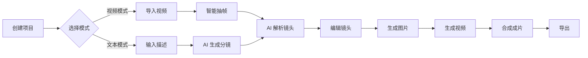

<h1 align="center">🎬 分镜大师 Storyboard Studio</h1>

<p align="center">
  <b>AI 驱动的专业分镜工作台 · 让视频创作更简单</b><br>
  <sub>视频导入 → 智能抽帧 → AI 解析 → 图片/视频生成 → 批量任务 → 成片合成</sub>
</p>

<p align="center">
  <a href="README.md">中文</a> | <a href="README.en.md">English</a>
</p>

<p align="center">
  
  
  
  
  
  
  
</p>

<p align="center">
  <a href="#-快速开始">快速开始</a> •
  <a href="#-功能亮点">功能特性</a> •
  <a href="#-界面预览">界面预览</a> •
  <a href="#-技术栈">技术栈</a> •
  <a href="https://gitee.com/nan1314/Storyboard/releases">下载</a>
</p>

---

## 💡 为什么选择分镜大师？

<table>
<tr>
<td width="50%">

### 🎯 专业级分镜工具
- ✨ **电影级参数控制**：支持镜头类型、构图、光线、色调等专业参数
- 🎨 **创意意图融合**：将创作目标、受众、基调融入 AI 生成
- 📊 **完整工作流**：从创意到成片的一站式解决方案

</td>
<td width="50%">

### 🚀 AI 智能加持
- 🤖 **多模态 AI**：支持文本理解、图片生成、视频生成
- 🔄 **智能分镜**：视频自动分镜 + 文本生成分镜双模式
- ⚡ **批量处理**：任务队列并发执行，效率倍增

</td>
</tr>
<tr>
<td width="50%">

### 🔒 本地优先
- 💾 **数据本地化**：SQLite 本地存储，数据完全掌控
- 🛠️ **内置工具**：FFmpeg 内置，无需额外安装
- 🌐 **跨平台**：Windows / Linux / macOS 全平台支持

</td>
<td width="50%">

### 🎁 开箱即用
- 📦 **一键安装**：自动更新，无需配置
- 🎨 **现代 UI**：Avalonia 跨平台界面，流畅体验
- 🔌 **灵活扩展**：支持多 AI 提供商，自由切换

</td>
</tr>
</table>

---

## 🎥 演示视频

> 📺 **在线演示**：[http://47.100.163.84/](http://47.100.163.84/) （仅 UI 界面，无后端）

<!-- 如果有演示视频，可以添加：
[](https://www.youtube.com/watch?v=YOUR_VIDEO_ID)
-->

---

## 🌟 核心特性

### 🎬 双模式创作

<table>
<tr>
<td width="50%" valign="top">

#### 📹 视频导入模式
从现有视频快速生成分镜脚本

- **智能抽帧**：4 种抽帧模式（定数/动态/等时/关键帧）
- **AI 解析**：自动分析镜头特征，生成结构化描述
- **元数据提取**：自动获取时长、分辨率、帧率等信息
- **场景识别**：智能识别场景变化和镜头切换

</td>
<td width="50%" valign="top">

#### ✍️ 文本生成模式
用自然语言描述，AI 自动生成分镜

- **智能拆分**：自动将描述拆分为多个镜头
- **场景理解**：识别场景转换和镜头关系
- **意图融合**：结合创作目标、受众、基调生成
- **专业参数**：自动生成镜头类型、构图、光线等参数

</td>
</tr>
</table>

### 🎨 AI 素材生成

| 功能 | 描述 | 支持平台 |
|------|------|----------|
| **🖼️ 图片生成** | 首帧/尾帧独立生成，支持专业参数控制 | 通义千问、火山引擎 Seedream |
| **🎞️ 视频生成** | 基于描述生成视频片段，支持镜头运动 | 火山引擎 Seedance |
| **📝 文本理解** | 智能分析和生成分镜描述 | 通义千问、火山引擎、OpenAI |

### ⚙️ 专业参数控制

支持电影级专业参数，让 AI 生成更符合预期：

```
📷 镜头类型：特写、中景、全景、远景、大远景
📐 构图方式：三分法、对称、黄金分割、中心构图
💡 光线设置：自然光、柔光、逆光、侧光、顶光
🎨 色调风格：暖色调、冷色调、高对比度、低饱和度
🎥 镜头运动：推拉摇移、跟随、环绕、升降
```

### 🚀 批量任务处理

- ⚡ **并发执行**：默认 2 个任务并发，可配置
- 🔄 **任务队列**：支持取消、重试、删除操作
- 📊 **进度监控**：实时查看任务状态和进度
- 📜 **历史记录**：完整的任务执行历史

---

## ✨ 功能亮点

<details open>
<summary><b>📁 项目管理</b></summary>

- ✅ 创建/打开/切换项目，SQLite 本地持久化
- ✅ 最近项目历史记录，快速访问
- ✅ 项目级元数据管理（创意意图、视频信息）
- ✅ 完整的项目生命周期管理

</details>

<details open>
<summary><b>🎥 视频导入与分析</b></summary>

- ✅ 支持主流视频格式（MP4、AVI、MOV、MKV 等）
- ✅ 自动提取视频元数据（时长/分辨率/帧率）
- ✅ FFprobe 智能视频分析
- ✅ 视频预览和时间轴展示

</details>

<details open>
<summary><b>🖼️ 智能抽帧（四种模式）</b></summary>

| 模式 | 描述 | 适用场景 |
|------|------|----------|
| **定数模式** | 提取指定数量的关键帧 | 快速预览，固定镜头数 |
| **动态间隔** | 根据场景变化动态调整间隔 | 复杂场景，自适应抽帧 |
| **等时模式** | 按固定时间间隔提取 | 均匀分布，时间轴对齐 |
| **关键帧检测** | 基于场景变化智能识别 | 精准捕捉场景转换 |

</details>

<details open>
<summary><b>✏️ 分镜编辑</b></summary>

- ✅ **全字段编辑**：镜头类型、核心内容、动作指令、场景设置
- ✅ **拖拽排序**：灵活调整镜头顺序，实时预览
- ✅ **时间轴可视化**：直观展示镜头时序关系
- ✅ **多视图模式**：网格视图、列表视图、时间线视图
- ✅ **批量操作**：批量编辑、删除、复制镜头

</details>

<details open>
<summary><b>🤖 AI 智能功能</b></summary>

#### AI 镜头解析
- ✅ 分析首尾帧特征，生成结构化镜头描述
- ✅ 三种处理策略：覆盖现有/追加内容/跳过已有
- ✅ 融合创意意图（创作目标、目标受众、视频基调、关键信息）
- ✅ 支持批量解析，队列管理

#### 文本生成分镜
- ✅ 自然语言描述自动拆分为多个镜头
- ✅ 智能识别场景转换和镜头切换
- ✅ 支持创意意图引导生成
- ✅ 自动生成专业参数（构图、光线、色调等）

</details>

<details open>
<summary><b>🎨 素材生成</b></summary>

#### 图片生成
- ✅ 首帧、尾帧独立生成，精准控制
- ✅ 专业参数支持：构图、光线、色调、镜头类型
- ✅ 多次生成保留历史，用户显式绑定最佳结果
- ✅ 支持通义千问 Wanx、火山引擎 Seedream

#### 视频生成
- ✅ 基于镜头描述生成视频片段
- ✅ 支持场景描述、动作描述、风格描述
- ✅ 镜头运动、特效参数配置
- ✅ 支持火山引擎 Seedance

</details>

<details open>
<summary><b>⚙️ 配置管理</b></summary>

- ✅ **多 Provider 支持**：通义千问、火山引擎、OpenAI、Azure OpenAI
- ✅ **多模型配置**：文本/图片/视频各自独立配置
- ✅ **可视化配置界面**：应用内直接配置，无需编辑文件
- ✅ **灵活切换**：按任务选择不同模型和提供商
- ✅ **本地与云端并存**：本地渲染与云端模型可并行配置

</details>

<details open>
<summary><b>📊 批量任务与任务管理</b></summary>

- ✅ 批量解析、生成、合成任务
- ✅ 任务队列管理，支持取消/重试/删除
- ✅ 并发执行（默认 2 个并发，可配置）
- ✅ 任务历史记录，完整审计日志
- ✅ 独立任务执行，互不干扰

</details>

<details open>
<summary><b>📤 导出与输出</b></summary>

- ✅ **分镜导出**：导出为 JSON 格式，支持剪映草稿导入
- ✅ **视频合成**：FFmpeg 合成最终视频，支持多种分辨率
- ✅ **输出管理**：项目级输出目录，自动组织文件
- ✅ **格式支持**：MP4、AVI、MOV 等主流格式

</details>

---

## 🌐 在线演示

> 🎮 **体验地址**：[http://47.100.163.84/](http://47.100.163.84/)
> 💡 **说明**：仅包含 UI 界面展示，无后端功能实现

---

## 🖼️ 界面预览

<table>
<tr>
<td width="50%">
<h3>🏠 首页 - 项目管理</h3>

<p>创建新项目，管理最近项目，快速开始创作</p>
</td>
<td width="50%">
<h3>🎬 主界面 - 工作区</h3>

<p>完整的分镜工作台，视频导入、抽帧、编辑一站式</p>
</td>
</tr>
<tr>
<td width="50%">
<h3>✏️ 分镜编辑 - 镜头管理</h3>

<p>拖拽排序，全字段编辑，多视图切换</p>
</td>
<td width="50%">
<h3>🚀 批量生成 - 任务处理</h3>

<p>批量生成图片和视频，队列管理，并发执行</p>
</td>
</tr>
<tr>
<td width="50%">
<h3>📊 任务管理 - 队列监控</h3>

<p>实时监控任务状态，支持取消、重试、删除</p>
</td>
<td width="50%">
<h3>📤 导出成品 - 视频合成</h3>

<p>FFmpeg 合成最终视频，支持多种分辨率和格式</p>
</td>
</tr>
</table>

<details>
<summary><b>查看更多截图</b></summary>

### ⚙️ AI 配置 - 模型设置

*多 Provider 配置，灵活切换不同 AI 模型*

</details>

---

## 🧭 完整工作流



### 📋 详细流程

<table>
<tr>
<th width="5%">步骤</th>
<th width="20%">操作</th>
<th width="35%">说明</th>
<th width="40%">技术实现</th>
</tr>
<tr>
<td align="center">1️⃣</td>
<td><b>创建项目</b></td>
<td>设置项目名称、创意意图</td>
<td>SQLite 数据库创建项目记录</td>
</tr>
<tr>
<td align="center">2️⃣</td>
<td><b>导入视频</b></td>
<td>选择视频文件，自动分析</td>
<td>FFprobe 提取元数据（时长、分辨率、帧率）</td>
</tr>
<tr>
<td align="center">3️⃣</td>
<td><b>智能抽帧</b></td>
<td>选择抽帧模式，提取关键帧</td>
<td>FFmpeg 根据选定模式提取关键帧</td>
</tr>
<tr>
<td align="center">4️⃣</td>
<td><b>AI 解析</b></td>
<td>分析首尾帧，生成镜头描述</td>
<td>通义千问/火山引擎分析首尾帧特征</td>
</tr>
<tr>
<td align="center">5️⃣</td>
<td><b>文本生成分镜</b></td>
<td>输入文本提示词，AI 生成</td>
<td>AI 自动拆分为多个镜头，生成专业参数</td>
</tr>
<tr>
<td align="center">6️⃣</td>
<td><b>编辑镜头</b></td>
<td>手动调整参数、顺序、描述</td>
<td>拖拽排序，全字段编辑，实时预览</td>
</tr>
<tr>
<td align="center">7️⃣</td>
<td><b>生成图片</b></td>
<td>批量生成首尾帧图片</td>
<td>火山引擎 Seedream 生成图片素材</td>
</tr>
<tr>
<td align="center">8️⃣</td>
<td><b>生成视频</b></td>
<td>批量生成视频片段</td>
<td>火山引擎 Seedance 生成视频片段</td>
</tr>
<tr>
<td align="center">9️⃣</td>
<td><b>合成成片</b></td>
<td>合并所有镜头为最终视频</td>
<td>FFmpeg 合并所有镜头，添加转场效果</td>
</tr>
<tr>
<td align="center">🔟</td>
<td><b>导出</b></td>
<td>保存分镜 JSON 和视频文件</td>
<td>导出为剪映草稿或标准视频格式</td>
</tr>
</table>

> 💡 **提示**：每个环节都可独立执行，支持手动编辑与批量任务处理，灵活适应不同创作需求。

---

## 🚀 快速开始

### 📦 方式一：安装包（推荐）

<table>
<tr>
<td width="50%">

#### 🇨🇳 国内用户（推荐）
从 Gitee 下载，速度更快：

1. 访问 [Gitee Release](https://gitee.com/nan1314/Storyboard/releases)
2. 下载最新版本的 `StoryboardSetup.exe`
3. 运行安装程序
4. 首次运行会自动提示安装 .NET 8 运行时

</td>
<td width="50%">

#### 🌍 国外用户
从 GitHub 下载：

1. 访问 [GitHub Release](https://github.com/YOUR_USERNAME/YOUR_REPO/releases)
2. 下载最新版本的 `StoryboardSetup.exe`
3. 运行安装程序
4. 首次运行会自动提示安装 .NET 8 运行时

</td>
</tr>
</table>

> ⚠️ **首次安装必读**
>
> 本软件需要 **.NET 8 桌面运行时**（约 55MB），首次使用请先安装：
>
> - **自动安装（推荐）**：直接运行安装程序，Windows 会自动提示下载
> - **手动预装**：访问 [.NET 8 下载页面](https://dotnet.microsoft.com/zh-cn/download/dotnet/8.0)，下载"桌面运行时 x64"
>
> 💡 运行时只需安装一次，后续更新无需重新安装

### 🔄 自动更新

本项目支持 **Gitee + GitHub 双源自动更新**：

- ✅ **国内用户**：优先使用 Gitee 更新源，速度快
- ✅ **国外用户**：自动切换到 GitHub 更新源
- ✅ **智能切换**：主源不可用时自动切换到备用源
- ✅ **增量更新**：只下载变化的部分，节省流量
- ✅ **后台更新**：不影响正常使用

**更新流程**：应用启动 3 秒后自动检查更新 → 发现新版本显示通知 → 点击"立即更新" → 重启后即为最新版本

详细配置请参考：[Gitee + GitHub 双源发布指南](docs/GITEE_RELEASE_GUIDE.md)

---

### 💻 方式二：从源码运行（开发者）

#### 环境要求
- .NET 8.0 SDK
- Windows / Linux / macOS（跨平台支持）
- Visual Studio 2022 或 JetBrains Rider（可选）

#### 命令行运行

```bash
# 1. 克隆项目
git clone https://github.com/YOUR_USERNAME/YOUR_REPO.git
cd 分镜大师

# 2. 还原依赖
dotnet restore

# 3. 编译项目
dotnet build

# 4. 运行应用
dotnet run
```

#### Visual Studio 2022

1. 打开 `Storyboard.sln`
2. 按 `F5` 直接运行
3. 开始调试和开发

---

### ⚙️ 首次配置

#### 1. 配置 AI 提供商

应用首次启动后，需要配置 AI 提供商才能使用 AI 功能：

1. 点击主界面的 **"提供商设置"** 按钮
2. 选择要使用的 AI 提供商（通义千问、火山引擎等）
3. 填入 API Key 和 Endpoint
4. 选择默认模型
5. 点击 **"保存"** 完成配置

<details>
<summary><b>查看支持的 AI 提供商</b></summary>

| 提供商 | 文本理解 | 图片生成 | 视频生成 | 获取 API Key |
|--------|---------|---------|---------|-------------|
| **通义千问** | ✅ | ✅ | ❌ | [阿里云控制台](https://dashscope.console.aliyun.com/) |
| **火山引擎** | ✅ | ✅ | ✅ | [火山引擎控制台](https://console.volcengine.com/) |
| **OpenAI** | ✅ | ❌ | ❌ | [OpenAI Platform](https://platform.openai.com/) |
| **Azure OpenAI** | ✅ | ❌ | ❌ | [Azure Portal](https://portal.azure.com/) |

</details>

#### 2. 创建第一个项目

1. 点击 **"创建新项目"**
2. 填写项目名称和创意意图（可选）
3. 选择创作模式：
   - **视频导入模式**：导入现有视频，自动生成分镜
   - **文本生成模式**：输入文本描述，AI 生成分镜
4. 开始创作！

---

## ⚙️ 配置管理

### 🎛️ 配置入口

- **推荐方式**：应用内「提供商设置」界面（可视化配置，无需编辑文件）
- **高级方式**：直接编辑 `appsettings.json`（支持更多高级选项）

### 🤖 支持的 AI 提供商

<table>
<tr>
<th>能力</th>
<th>提供商</th>
<th>模型示例</th>
<th>说明</th>
</tr>
<tr>
<td rowspan="4"><b>📝 文本理解</b></td>
<td>通义千问</td>
<td>qwen-plus, qwen-max</td>
<td>阿里云大模型，中文理解能力强</td>
</tr>
<tr>
<td>火山引擎</td>
<td>doubao-pro-4k, doubao-pro-32k</td>
<td>字节跳动大模型，性价比高</td>
</tr>
<tr>
<td>OpenAI</td>
<td>gpt-4, gpt-3.5-turbo</td>
<td>国际领先，需要科学上网</td>
</tr>
<tr>
<td>Azure OpenAI</td>
<td>gpt-4, gpt-35-turbo</td>
<td>微软 Azure 部署，企业级稳定</td>
</tr>
<tr>
<td rowspan="2"><b>🎨 图片生成</b></td>
<td>通义千问</td>
<td>wanx-v1</td>
<td>万相图片生成，支持多种风格</td>
</tr>
<tr>
<td>火山引擎</td>
<td>seedream-v1</td>
<td>Seedream 图片生成，质量高</td>
</tr>
<tr>
<td><b>🎞️ 视频生成</b></td>
<td>火山引擎</td>
<td>seedance-v1</td>
<td>Seedance 视频生成，支持镜头运动</td>
</tr>
</table>

### 📝 配置示例

<details>
<summary><b>查看完整配置示例</b></summary>

```json
{
  "AIServices": {
    "Providers": {
      "Qwen": {
        "ApiKey": "sk-your-qwen-api-key",
        "Endpoint": "https://dashscope.aliyuncs.com/compatible-mode/v1",
        "DefaultModels": {
          "Text": "qwen-plus",
          "Image": "wanx-v1"
        }
      },
      "Volcengine": {
        "ApiKey": "your-volcengine-api-key",
        "Endpoint": "https://ark.cn-beijing.volces.com/api/v3",
        "DefaultModels": {
          "Text": "ep-20241218xxxxx-xxxxx",
          "Image": "seedream-v1",
          "Video": "seedance-v1"
        }
      },
      "OpenAI": {
        "ApiKey": "sk-your-openai-api-key",
        "Endpoint": "https://api.openai.com/v1",
        "DefaultModels": {
          "Text": "gpt-4"
        }
      }
    },
    "Defaults": {
      "Text": {
        "Provider": "Volcengine",
        "Model": "ep-20241218xxxxx-xxxxx"
      },
      "Image": {
        "Provider": "Volcengine",
        "Model": "seedream-v1"
      },
      "Video": {
        "Provider": "Volcengine",
        "Model": "seedance-v1"
      }
    }
  }
}
```

</details>

### ✨ 配置能力

- ✅ **多 Provider 并存**：同时配置多个提供商，按需切换
- ✅ **多模型配置**：每个提供商可配置多个模型
- ✅ **独立默认设置**：文本/图片/视频各自独立配置默认模型
- ✅ **任务级切换**：每个任务可选择不同的模型和提供商
- ✅ **本地与云端并存**：本地渲染/合成与云端模型可并行配置

---

## 🗂️ 项目结构

```
分镜大师/
├─ 📱 App/                          # Avalonia UI 层
│  ├─ Views/                        # XAML 视图组件
│  ├─ ViewModels/                   # MVVM 视图模型
│  ├─ Converters/                   # 值转换器
│  ├─ Messages/                     # 消息传递
│  └─ App.axaml.cs                  # 依赖注入配置
│
├─ 🎯 Application/                  # 应用层（用例）
│  ├─ Abstractions/                 # 服务接口
│  ├─ Services/                     # 应用服务
│  │  ├─ ProjectService.cs          # 项目管理服务
│  │  ├─ ShotService.cs             # 镜头管理服务
│  │  ├─ VideoAnalysisService.cs   # 视频分析服务
│  │  └─ TaskQueueService.cs        # 任务队列服务
│  └─ DTOs/                         # 数据传输对象
│
├─ 🏛️ Domain/                       # 领域层（业务逻辑）
│  └─ Entities/                     # 核心领域模型
│     ├─ Project.cs                 # 项目实体（350+ 属性）
│     ├─ Shot.cs                    # 镜头实体（完整分镜参数）
│     └─ ShotAsset.cs               # 素材资产实体
│
├─ 🔧 Infrastructure/               # 基础设施层
│  ├─ AI/                           # AI 服务集成
│  │  ├─ Core/                      # AI 提供商接口
│  │  ├─ Providers/                 # 通义千问、火山引擎实现
│  │  │  ├─ QwenProvider.cs         # 通义千问适配器
│  │  │  └─ VolcengineProvider.cs   # 火山引擎适配器
│  │  ├─ Prompts/                   # 提示词模板管理
│  │  │  ├─ shot_analysis.json      # 镜头分析模板
│  │  │  ├─ text_to_shots.json      # 文本生成分镜模板
│  │  │  └─ image_generation.json   # 图片生成模板
│  │  └─ AIServiceManager.cs        # AI 服务编排
│  │
│  ├─ Media/                        # 媒体处理
│  │  ├─ Providers/                 # 图片/视频生成提供商
│  │  │  ├─ QwenImageProvider.cs    # 通义千问图片生成
│  │  │  ├─ SeedreamProvider.cs     # Seedream 图片生成
│  │  │  └─ SeedanceProvider.cs     # Seedance 视频生成
│  │  └─ FfmpegLocator.cs           # FFmpeg 集成
│  │
│  ├─ Persistence/                  # 数据库与 EF Core
│  │  ├─ StoryboardDbContext.cs     # 数据库上下文
│  │  └─ Repositories/              # 仓储实现
│  │
│  ├─ Configuration/                # 配置管理
│  │  └─ AIServiceConfiguration.cs  # AI 服务配置
│  │
│  └─ Services/                     # 基础设施服务
│     ├─ VideoProcessingService.cs  # 视频处理服务
│     └─ FileStorageService.cs      # 文件存储服务
│
├─ 🔗 Shared/                       # 共享模型与 DTO
├─ 🛠️ Tools/ffmpeg/                 # 内置 FFmpeg/FFprobe
├─ 📋 Prompts/                      # AI 提示词模板
├─ ⚙️ appsettings.json              # 应用配置文件
└─ 📦 Storyboard.sln                # 解决方案文件
```

### 🏗️ 架构特点

<table>
<tr>
<td width="50%">

#### 设计模式
- **分层架构**：Domain / Application / Infrastructure / App
- **MVVM 模式**：响应式 UI，MVVM Toolkit + Messenger
- **依赖注入**：完整的 DI 配置，松耦合设计
- **仓储模式**：数据访问层抽象

</td>
<td width="50%">

#### 技术实践
- **异步编程**：全面使用 async/await
- **多线程**：任务队列支持并发（默认 2 个）
- **事件驱动**：MVVM Messenger 消息传递
- **EF Core 迁移**：数据库版本管理

</td>
</tr>
</table>

---

## 📦 数据与输出

### 💾 数据存储

<table>
<tr>
<td width="33%">

#### 📍 存储位置
- **数据库**：`Data/storyboard.db`
- **位置**：应用启动目录下
- **类型**：SQLite 单文件数据库

</td>
<td width="33%">

#### 🔄 迁移管理
- **自动迁移**：启动时自动执行
- **版本管理**：EF Core Migrations
- **增量更新**：无需手动干预

</td>
<td width="33%">

#### 🔒 数据安全
- **本地存储**：数据完全掌控
- **无云同步**：隐私保护
- **备份简单**：复制 .db 文件即可

</td>
</tr>
</table>

### 📂 输出目录结构

```
output/
└─ projects/
   └─ <ProjectId>/              # 项目 ID 目录
      ├─ images/                # 图片素材
      │  ├─ shot_1_first.png    # 镜头 1 首帧
      │  ├─ shot_1_last.png     # 镜头 1 尾帧
      │  └─ ...
      ├─ videos/                # 视频素材
      │  ├─ shot_1.mp4          # 镜头 1 视频
      │  └─ ...
      └─ exports/               # 导出文件
         ├─ storyboard.json     # 分镜 JSON
         └─ final_video.mp4     # 最终合成视频
```

---

## 🧰 FFmpeg 依赖

### 📦 内置工具

项目已内置 `Tools/ffmpeg` 目录，包含：

| 工具 | 用途 | 说明 |
|------|------|------|
| **ffmpeg.exe** | 视频处理与合成 | 抽帧、合成、转码 |
| **ffprobe.exe** | 视频元数据分析 | 提取时长、分辨率、帧率 |

### ✨ 特性

- ✅ **无需安装**：开箱即用，自动检测
- ✅ **跨平台**：Windows / Linux / macOS 支持
- ✅ **自动定位**：优先使用内置版本，支持系统版本
- ✅ **完整功能**：支持所有主流视频格式和编码

---

## 🧪 技术栈

<table>
<tr>
<th width="25%">技术领域</th>
<th width="35%">技术选型</th>
<th width="40%">说明</th>
</tr>
<tr>
<td><b>🎯 核心框架</b></td>
<td>.NET 8 + Avalonia 11.x</td>
<td>现代化跨平台框架，性能优异</td>
</tr>
<tr>
<td><b>🎨 UI 框架</b></td>
<td>Avalonia (XAML)</td>
<td>跨平台 UI，类似 WPF 开发体验</td>
</tr>
<tr>
<td><b>🏗️ 架构模式</b></td>
<td>MVVM + 分层架构</td>
<td>清晰的职责分离，易于维护</td>
</tr>
<tr>
<td><b>📊 状态管理</b></td>
<td>MVVM Toolkit</td>
<td>CommunityToolkit.Mvvm，简化 MVVM 开发</td>
</tr>
<tr>
<td><b>📡 消息传递</b></td>
<td>MVVM Messenger</td>
<td>WeakReferenceMessenger，松耦合通信</td>
</tr>
<tr>
<td><b>💾 数据库</b></td>
<td>SQLite + EF Core 8.0</td>
<td>轻量级嵌入式数据库，零配置</td>
</tr>
<tr>
<td><b>🔄 ORM</b></td>
<td>Entity Framework Core</td>
<td>支持迁移，Code First 开发</td>
</tr>
<tr>
<td><b>📝 日志</b></td>
<td>Serilog</td>
<td>结构化日志，支持多种输出</td>
</tr>
<tr>
<td><b>🎬 媒体处理</b></td>
<td>FFmpeg/FFprobe</td>
<td>内置版本，无需额外安装</td>
</tr>
<tr>
<td><b>🖼️ 图像处理</b></td>
<td>SkiaSharp 2.88.9</td>
<td>跨平台 2D 图形库</td>
</tr>
<tr>
<td><b>🤖 AI 集成</b></td>
<td>Semantic Kernel</td>
<td>微软 AI 编排框架 + 多提供商适配器</td>
</tr>
<tr>
<td><b>🌐 HTTP 客户端</b></td>
<td>Microsoft.Extensions.Http</td>
<td>HttpClientFactory，连接池管理</td>
</tr>
<tr>
<td><b>💉 依赖注入</b></td>
<td>Microsoft.Extensions.DI</td>
<td>内置 DI 容器，完整生命周期管理</td>
</tr>
<tr>
<td><b>⚙️ 配置管理</b></td>
<td>Microsoft.Extensions.Configuration</td>
<td>JSON 配置，支持热重载</td>
</tr>
<tr>
<td><b>🌐 WebView</b></td>
<td>WebView.Avalonia</td>
<td>内嵌浏览器，支持 Web 内容展示</td>
</tr>
<tr>
<td><b>🔄 自动更新</b></td>
<td>Velopack 0.0.942</td>
<td>现代化更新框架，支持增量更新</td>
</tr>
</table>

---

## 🎯 核心特性深度解析

### 1. 🎨 创意意图融合

在 AI 生成过程中，可以设置完整的创意意图，让 AI 生成更符合预期：

<table>
<tr>
<td width="25%"><b>创作目标</b></td>
<td width="75%">视频的核心目的（如：产品宣传、教学演示、故事叙述）</td>
</tr>
<tr>
<td><b>目标受众</b></td>
<td>面向的观众群体（如：年轻人、专业人士、儿童）</td>
</tr>
<tr>
<td><b>视频基调</b></td>
<td>整体风格和氛围（如：轻松幽默、严肃专业、温馨感人）</td>
</tr>
<tr>
<td><b>关键信息</b></td>
<td>必须传达的核心内容（如：产品特点、操作步骤、情感共鸣）</td>
</tr>
</table>

AI 会根据这些意图生成更符合预期的分镜和素材，大幅提升创作效率。

### 2. 🎬 专业参数控制

支持电影级专业参数，让 AI 生成更加精准：

<details>
<summary><b>📷 镜头类型（Shot Type）</b></summary>

- **特写（Close-up）**：突出细节，强调情感
- **中景（Medium Shot）**：展示人物上半身，平衡环境与人物
- **全景（Full Shot）**：展示完整人物，包含环境信息
- **远景（Long Shot）**：展示大场景，营造氛围
- **大远景（Extreme Long Shot）**：展示宏大场景，建立空间感

</details>

<details>
<summary><b>📐 构图方式（Composition）</b></summary>

- **三分法（Rule of Thirds）**：经典构图，视觉平衡
- **对称构图（Symmetry）**：庄重、稳定
- **黄金分割（Golden Ratio）**：自然和谐
- **中心构图（Center）**：突出主体
- **对角线构图（Diagonal）**：动感、张力

</details>

<details>
<summary><b>💡 光线设置（Lighting）</b></summary>

- **自然光（Natural Light）**：真实、柔和
- **柔光（Soft Light）**：减少阴影，适合人像
- **逆光（Backlight）**：轮廓光，营造氛围
- **侧光（Side Light）**：立体感、层次感
- **顶光（Top Light）**：戏剧化效果

</details>

<details>
<summary><b>🎨 色调风格（Color Tone）</b></summary>

- **暖色调（Warm Tone）**：温馨、舒适
- **冷色调（Cool Tone）**：冷静、科技感
- **高对比度（High Contrast）**：强烈、戏剧化
- **低饱和度（Desaturated）**：复古、文艺

</details>

<details>
<summary><b>🎥 镜头运动（Camera Movement）</b></summary>

- **推镜头（Push In）**：逐渐靠近主体，增强代入感
- **拉镜头（Pull Out）**：逐渐远离，展现环境
- **摇镜头（Pan）**：水平移动，展示场景
- **移镜头（Tracking）**：跟随主体移动
- **环绕（Orbit）**：围绕主体旋转，展示全貌

</details>

### 3. 📦 素材资产管理

- **多次生成**：每个镜头可生成多次图片/视频，保留所有历史
- **显式绑定**：用户手动选择最佳素材，精准控制
- **预览对比**：并排对比不同生成结果，快速决策
- **元数据记录**：记录生成参数、模型、提示词，可追溯

### 4. ⚡ 批量任务处理

- **任务队列**：独立执行，互不干扰
- **并发控制**：默认 2 个并发，可配置（1-10）
- **任务管理**：支持取消、重试、删除操作
- **进度监控**：实时查看任务状态和进度
- **历史记录**：完整的任务执行历史，支持查询和审计

---

## 🗺️ 产品路线图

### 🚀 即将推出（v2.0）

- [ ] 🔊 **TTS 智能配音**：自动生成旁白和对话配音
- [ ] ✂️ **自动剪辑优化**：AI 优化镜头时长和转场
- [ ] 🎨 **自动风格迁移**：一键应用电影级调色风格
- [ ] 📱 **社交平台一键发布**：直接发布到抖音、B站等平台

### 🔮 未来规划（v3.0+）

- [ ] 🎵 **背景音乐智能匹配**：根据视频节奏自动匹配音乐
- [ ] 📊 **数据分析与优化建议**：分析视频数据，提供优化建议
- [ ] 👥 **团队协作功能**：多人协作编辑，实时同步
- [ ] ☁️ **云端同步与备份**：项目云端存储，多设备同步
- [ ] 🌍 **多语言支持**：支持英语、日语等多种语言
- [ ] 🎭 **角色库管理**：预设角色库，快速应用到分镜

---

## 🤝 贡献指南

我们欢迎所有形式的贡献！无论是报告 Bug、提出新功能建议，还是提交代码改进。

### 🐛 报告问题

发现 Bug？请通过 [GitHub Issues](https://github.com/YOUR_USERNAME/YOUR_REPO/issues) 报告：

1. 描述问题现象
2. 提供复现步骤
3. 附上错误日志（如有）
4. 说明运行环境（操作系统、.NET 版本）

### 💡 功能建议

有好的想法？欢迎通过 [GitHub Discussions](https://github.com/YOUR_USERNAME/YOUR_REPO/discussions) 讨论：

1. 描述功能需求
2. 说明使用场景
3. 提供参考案例（如有）

### 🔧 开发环境搭建

```bash
# 1. Fork 并克隆项目
git clone https://github.com/YOUR_USERNAME/YOUR_REPO.git
cd 分镜大师

# 2. 安装依赖
dotnet restore

# 3. 运行项目
dotnet run

# 4. 运行测试（如有）
dotnet test
```

### 📝 提交规范

- **代码风格**：遵循现有代码风格，使用 EditorConfig
- **提交信息**：清晰描述改动内容，使用中文或英文
- **单元测试**：为新功能添加测试（如适用）
- **文档更新**：更新相关文档和注释

### 🎯 贡献方向

我们特别欢迎以下方向的贡献：

- 🌍 **国际化**：添加多语言支持
- 🎨 **UI/UX 改进**：优化界面设计和用户体验
- 🤖 **AI 提供商**：集成更多 AI 服务提供商
- 📚 **文档完善**：改进文档、添加教程
- 🐛 **Bug 修复**：修复已知问题
- ⚡ **性能优化**：提升应用性能

---

## 📄 许可证

本项目采用 **MIT 许可证**。详见 [LICENSE](LICENSE) 文件。

这意味着您可以：
- ✅ 商业使用
- ✅ 修改代码
- ✅ 分发代码
- ✅ 私人使用

但需要：
- 📋 保留版权声明
- 📋 保留许可证声明

---

## 📧 联系方式

<table>
<tr>
<td width="33%" align="center">

### 💬 问题反馈
[GitHub Issues](https://github.com/YOUR_USERNAME/YOUR_REPO/issues)

报告 Bug 和技术问题

</td>
<td width="33%" align="center">

### 💡 功能建议
[GitHub Discussions](https://github.com/YOUR_USERNAME/YOUR_REPO/discussions)

讨论新功能和改进建议

</td>
<td width="33%" align="center">

### 🤝 商务合作
通过 GitHub 联系

企业定制和商务合作

</td>
</tr>
</table>

---

## ⭐ Star History

如果这个项目对您有帮助，请给我们一个 Star ⭐！

[](https://star-history.com/#YOUR_USERNAME/YOUR_REPO&Date)

---

## 🙏 致谢

感谢以下开源项目和服务：

- [Avalonia](https://avaloniaui.net/) - 跨平台 UI 框架
- [FFmpeg](https://ffmpeg.org/) - 强大的媒体处理工具
- [Semantic Kernel](https://github.com/microsoft/semantic-kernel) - AI 编排框架
- [Serilog](https://serilog.net/) - 结构化日志库
- [SkiaSharp](https://github.com/mono/SkiaSharp) - 跨平台 2D 图形库

---

<p align="center">
  <b>🎬 让创意更快落地，让分镜更加专业 🎬</b><br><br>
  <sub>用分镜大师，开启高效视频创作之旅！</sub><br><br>
  <a href="#-快速开始">立即开始</a> •
  <a href="https://gitee.com/nan1314/Storyboard/releases">下载安装</a> •
  <a href="http://47.100.163.84/">在线演示</a>
</p>

<p align="center">
  Made with ❤️ by the Storyboard Studio Team
</p>

