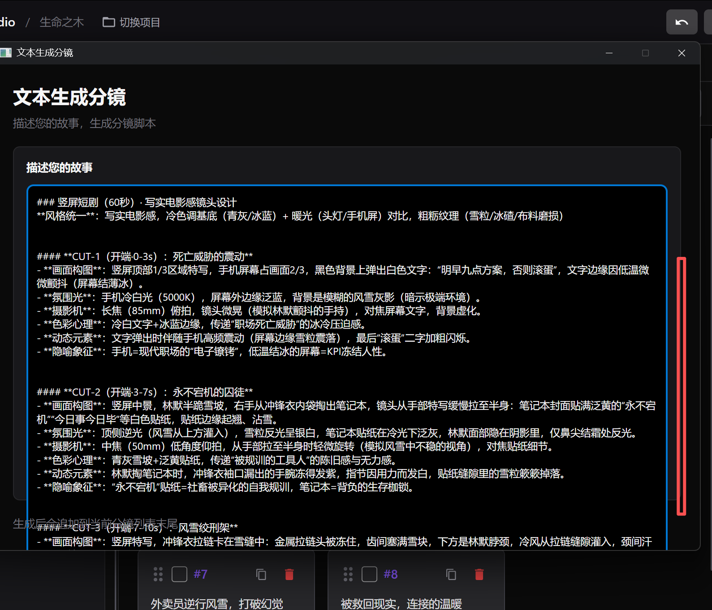
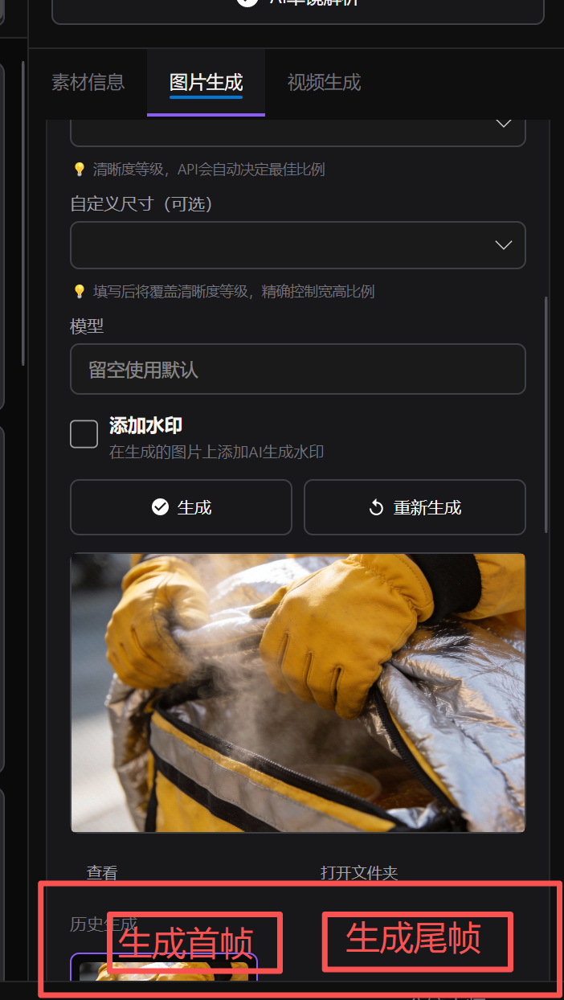
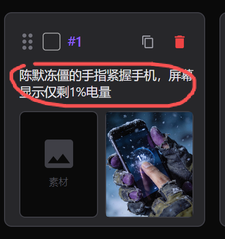
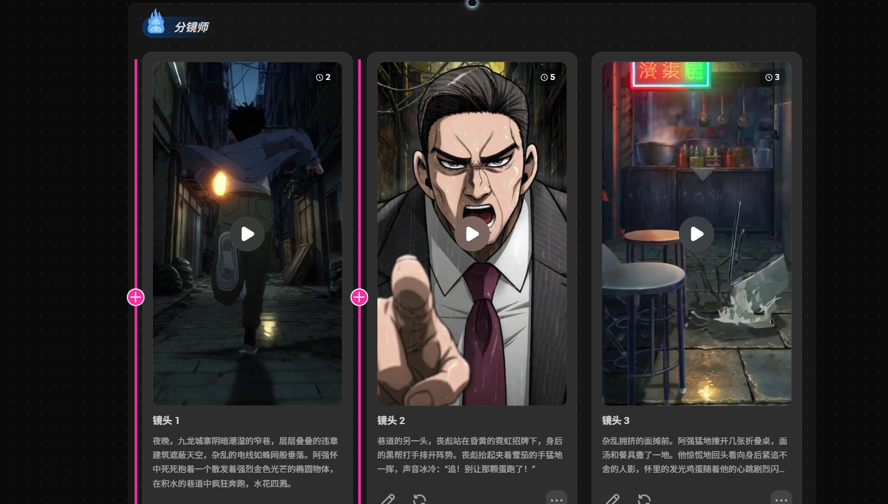
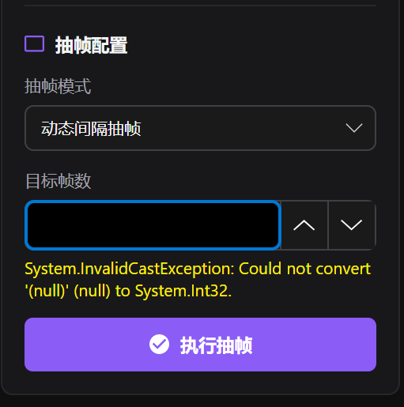

问题1：文本生成分镜，内容太长了无法提交。

问题2：图片生成，生成首帧、生成尾帧。两个按钮，悬浮固定底部，减少用户滑动滚动条的操作

问题3：ShotCardView.axaml.cs 这个页面显示的内容，用户无法编辑。业务流程 在那个文本创作里面输入了一个大纲，然后它自动分切出了每一个分镜的那个概括。用图片生成首尾帧提示词去细细化描述

问题4：加一个小按钮，提高增加分镜的友好度。这样可以直接点个加号，然后它关联上下文，先aI生成那个中间的文字，这样子先看看效果行不行，不行再人工干预。

问题5： 导入视频，抽帧操作，是不是不需要每个类型都设置帧数？

问题6： 智能分镜，剪映里面有个智能镜头分割，我感觉挺成熟的，你能调用AI模型，添加一个分镜方式吗？
* 我不成熟的想法：使用ffmpeg，ffprobe。按照视频帧率和关键帧抽出来，然后压缩到一张图，比如16宫格，提示词，确定图片中，哪个模块对应的时间，让ai去分析镜头切割点和完整视频动作提示词。按照专业角度，从镜头、节奏等多个专业角度分析。然后直接到镜头里

问题7: 文本生成分镜，用户无法控制让AI生成多少个镜头

问题8：缺乏资源库这个概念。按照现在AI漫剧的软件概念，用户可以管理自己的资源库。

问题9： 首帧尾帧、图片，用户可以本地上传自己的/可以使用资源库中的